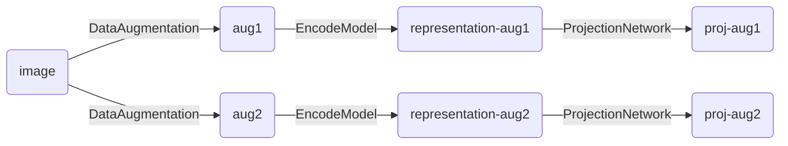

**NOTE:** This page records the research process of this project. Therefore, trials and ineffective ideas are also presented here.

**NOTE:** We have presented all useful information in the paper preprint at <a href="https://doi.org/10.1101/2021.11.15.468566">BioRxiv</a> and <a href="https://arxiv.org/abs/2111.09656">Arxiv</a>.

### Project Introduction

To improve the metagenome binning step and recover better metagenomes, we propose a deep Contrastive Learning framework for Metagenome Binning (CLMB), which can efficiently eliminate the disturbance of noise and produce more stable and robust results.

### Problem Definition

Binning is the process that group contigs from microbiome samples. The abundances and the per-sequence tetranucleotide frequencies (TNF) are proved as effective feature data for separating contigs. Popular binning methods take the binning problem as a clustering task. However, due to the diversity of contigs, directly clustering the abundances and the TNFs might generate bad results. Therefore, it's important to learn useful representations from feature data.

### Algorithm

#### Contrastive Learning Framework

###### [Simclr](https://arxiv.org/abs/2002.05709)
Simclr was initially developed to encode images without labels into feature data with auto-generated labels. Experiments proved that it learns useful representations for images.

#### How to transfer the simclr?

##### Data Augmentation
Metagenome binning takes numerical vectors as input instead of images. Augmentations for images in simclr simulate the transformations of images in different cases, such as cropping and Gaussian noise. For metagenome binning, simply distorting numerical data is useful. However, simulating the difference of contigs in species is more helpful.

- How to simply distort numerical data: add Gaussian noise.
- How to simulate the difference of contigs in species: during the process of DNA replication, there might occur base substitutions, insertions, and deletions. The changes are accumulated before new species come into being.

##### Encode Model and Projection Network

**Trial 1**.
For the prototype, I used 2 layer FC (fully connected layers) as the encoder model and 2 layer FC (fully connected layers) as the projection network. However, it achieved bad performance no matter what the parameters.

**Trial 2**.
I tried to modify the encoder model with other autoencoders, such as k-competitive encoder and LSTM. I kept 2 layer FC (fully connected layers) as the projection network to coordinate with simclr. However, all of them did not achieve better performance than previous work no matter what the parameters.

**Trial 3 (Succeed)**.
[VAMB](https://doi.org/10.1038/s41587-020-00777-4) for metagenome binning utilized VAE to reorganize the data. It occured to me that we can regard the encoder of VAE with the reparameterizing process as the encode model, and the decoder of VAE as the projection network.
Moreover, experiments showed that Contrastive Loss from contrastive learning, KL divergence from VAE, and cross-entropy from AE are all important for training.

##### Parameters
For hyperparameters, we can use the architecture and conclusion of VAMB and Simclr.
For parameters for calculation, the default parameter is good for benchmark results, but I'm not sure for other datasets. For applications, I suggest that you should check the binning results with CheckM and change the parameters when CheckM indicated CLMB obtained bad results.