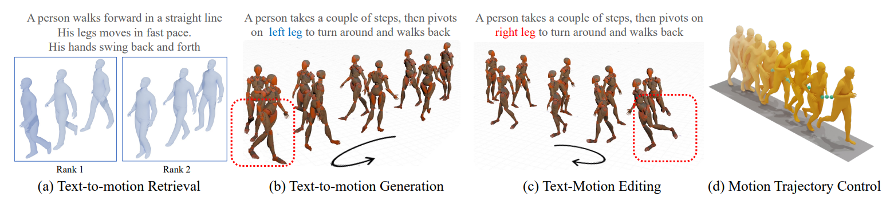
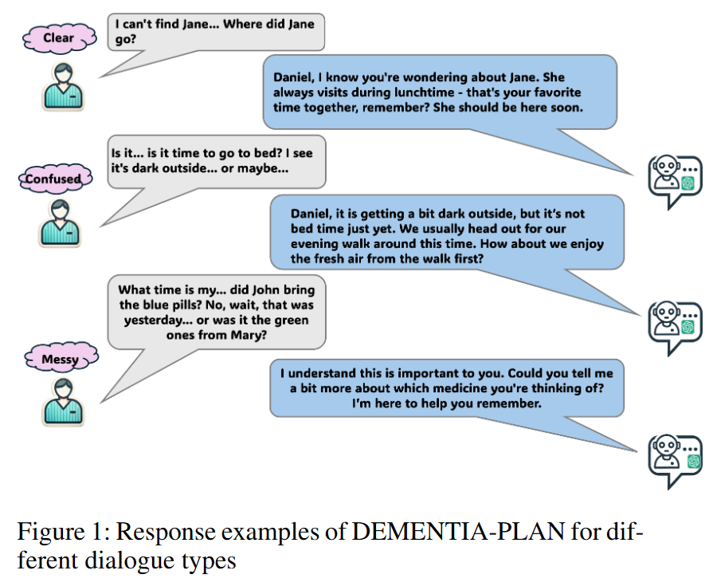
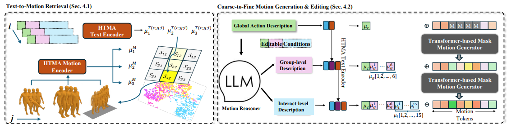
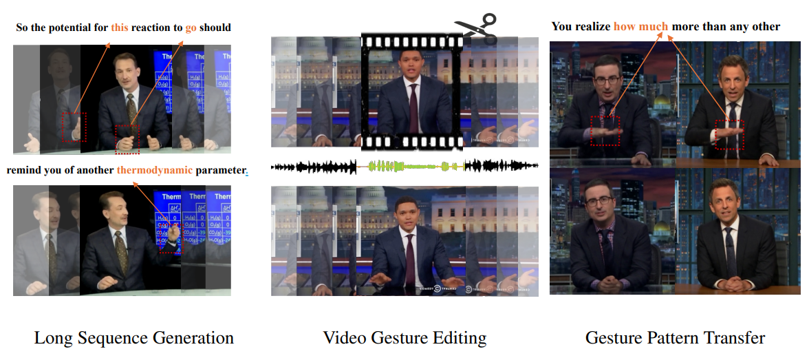
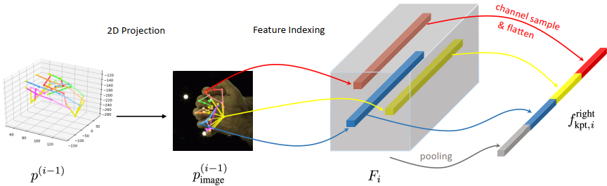
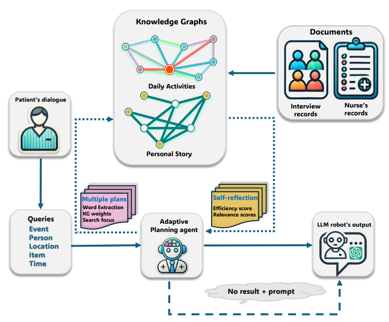
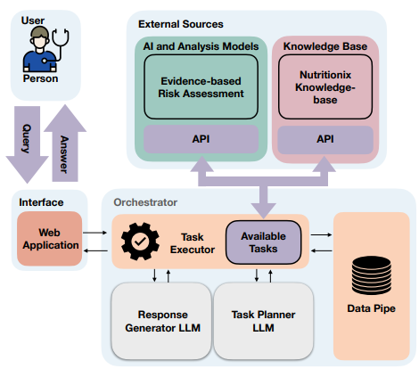
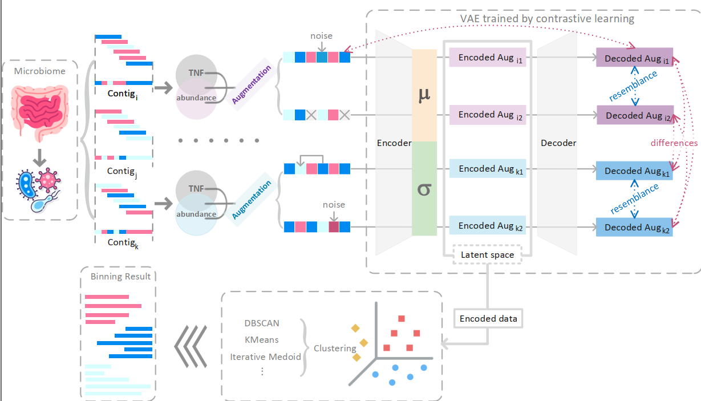

Pengfei Zhang is a PHD student in UC Irvine, majoring in Computer Science. His main research field is applied generative model for multi-modal generation, including retrieval augmented generation for large language models, diffusion-based speech generation, and text or audio driven motion Synthesis. His research interest involves Motion Synthesis and Generation, Large Language/Vision Models (LLMs/LVMs), Retrieval Augmented Generation, Diffusion models, and Pose Estimation. He obtained Bachelor degree in Computer Science at USTC in 2021. His resume is presented in [Pengfei’s CV](files/PengfeiZhang_resume.pdf).

---

<!-- #### NEWS 

06/2024: Start a position at Flawless. Inc!

10/2023: One paper is accepted by WACV 2024! -->
<!-- 
10/2023: Switched to the new lab with research on artificial intelligence, computer vision, and large language model for healthcare!

05/2022: One paper is accepted by RECOMB 2023 for oral presentation! -->

<!-- ##### Website Introduction

My scientific experiences are recorded in [research](https://zpf0117b.github.io/PengfeiZhang.github.io/research/) and [publications](https://zpf0117b.github.io/PengfeiZhang.github.io/publications/).  -->

<!-- <embed src="http://files2.17173.com/__flash/2011/10/21/honehone_clock_tr.swf"> -->

# Research

### Multi-modal Generation

| Jan 2023 - Present       | &nbsp;         |
| ---- |:---------------:|
| Multimodal generation refers to the ability of artificial intelligence systems to generate content across multiple data modalities—such as text, images, audio, and motion—either individually or in a coordinated way. This represents a significant leap from unimodal models (e.g., text-only) toward more human-like capabilities in perception and expression. Recent advances in machine learning, particularly in large language models (LLMs) and diffusion models, have enabled highly expressive and context-aware generation across modalities. |  | 
| **Publications:**        | &nbsp;         |
|  | DEMENTIA-PLAN: An Agent-Based Framework for Multi-Knowledge Graph Retrieval-Augmented Generation in Dementia Care   Yutong Song, Chenhen Lyu, **Pengfei Zhang**, Sabine Brunswicker, Nikil Dutt, Amir Rahmani  [\[preprint\]](https://arxiv.org/abs/2503.20950) |
|  | KinMo: Kinematic-aware Human Motion Understanding and Generation.  **Pengfei Zhang**, Pinxin Liu, Pablo Garrido, Hyeongwoo Kim, Bindita Chaudhuri.  [\[project\]](https://andypinxinliu.github.io/KinMo/) [\[preprint\]](https://arxiv.org/abs/2411.15472) [\[demo\]](https://andypinxinliu.github.io/KinMo/static/videos/KinMo-Demo.mp4) |
|  |  Contextual Gesture: Co-Speech Gesture Video Generation through Semantic-aware Gesture Representation.  Pinxin Liu, **Pengfei Zhang**, Hyeongwoo Kim, Pablo Garrido, Ari Shapiro, Kyle Olszewski.  [\[project\]](https://andypinxinliu.github.io/Contextual-Gesture/) [\[preprint\]](https://arxiv.org/abs/2502.07239)  |
|  |  Handformer2T: A Lightweight Regression-based model for Interacting Hands Pose Estimation from a single RGB Image.  **Pengfei Zhang**, Deying Kong.   WACV 2024   [\[paper\]](https://openaccess.thecvf.com/content/WACV2024/html/Zhang_Handformer2T_A_Lightweight_Regression-Based_Model_for_Interacting_Hands_Pose_Estimation_WACV_2024_paper.html) |

### Large Language Model-Assisted Healthcare

| Sep 2021 - Present       | &nbsp;         |
| ---- |:---------------:|
| Healthcare informatics combines medical data analysis with advanced computing, particularly through bioinformatics and AI applications. Bioinformatics focuses on analyzing biological data like genomics for drug discovery and personalized medicine, while Large Language Models power clinical decision support, patient care automation, and personalized nutrition recommendations. The field faces challenges in data privacy and clinical validation but promises significant advances in personalized medicine and preventive care through multimodal data integration and advanced analytics. |  |
| **Publications:**        | &nbsp; |
|  |  DEMENTIA-PLAN: An Agent-Based Framework for Multi-Knowledge Graph Retrieval-Augmented Generation in Dementia Care.  Yutong Song, Chenhan Lyu, **Pengfei Zhang**, Sabine Brunswicker, Nikil Dutt, Amir M. Rahmani.  AAAI 2025 Workshop: Knowledge Graphs for Health Equity, Justice, and Social Services  [\[preprint\]](https://openreview.net/pdf?id=m7KkNKMDVp) |
|  | Knowledge-Infused LLM-Powered Conversational Health Agent: A Case Study for Diabetes Patients.  Mahyar Abbasian, Zhongqi Yang, Elahe Khatibi, **Pengfei Zhang**, Nitish Nagesh, Iman Azimi, Ramesh Jain, Amir M. Rahmani.  EMBC 2024   [\[paper\]](https://arxiv.org/abs/2402.10153) [\[code\]](https://github.com/Institute4FutureHealth/CHA) [\[website\]](https://www.opencha.com/) |
|  | CLMB: deep contrastive learning for robust metagenomic binning **Pengfei Zhang**, Zhengyuan Jiang, Yixuan Wang, Yu Li. RECOMB 2022 (oral) [\[paper\]](https://doi.org/10.1101/2021.11.15.468566) [\[code\]](https://github.com/zpf0117b/CLMB/) [\[blog\]](https://zpf0117b2.github.io/feifei.github.io/2022/01/20/contrastive-learning-for-robust-metagenome-binning/)     |

# Internships

Research Science Intern at Flawless. AI. Inc. Location: Los Angeles

Research Intern in the Chinese University of Hong Kong. Location: Hong Kong

# Projects

| Personal Software Programming Projects  | &nbsp;         |
| ---- |:---------------:|
| [\[Distributed Chatroom with LLaMa-Powered Summarization\]](https://github.com/zpf0117b/Distributed-Chatroom-with-LLaMa-Powered-Summarization)  |  A Multi-topic Web Chatroom which can provide backup on previous conversations and LLaMa Powered summarizations after each refresh |

| Collaborative Lab Projects | &nbsp;         |
| ---- |:---------------:|
| [\[OpenCHA - an Automatic Conversational Health Agent\]](https://github.com/Institute4FutureHealth/CHA)  |  [\[website\]](https://www.opencha.com/)   A Conversational Health Agent framework with LLM API Integration |

# Awards

Dean's award from UCI

National Encouragement Scholarship (top 20%) from USTC

National Encouragement Scholarship (top 20%) from USTC
