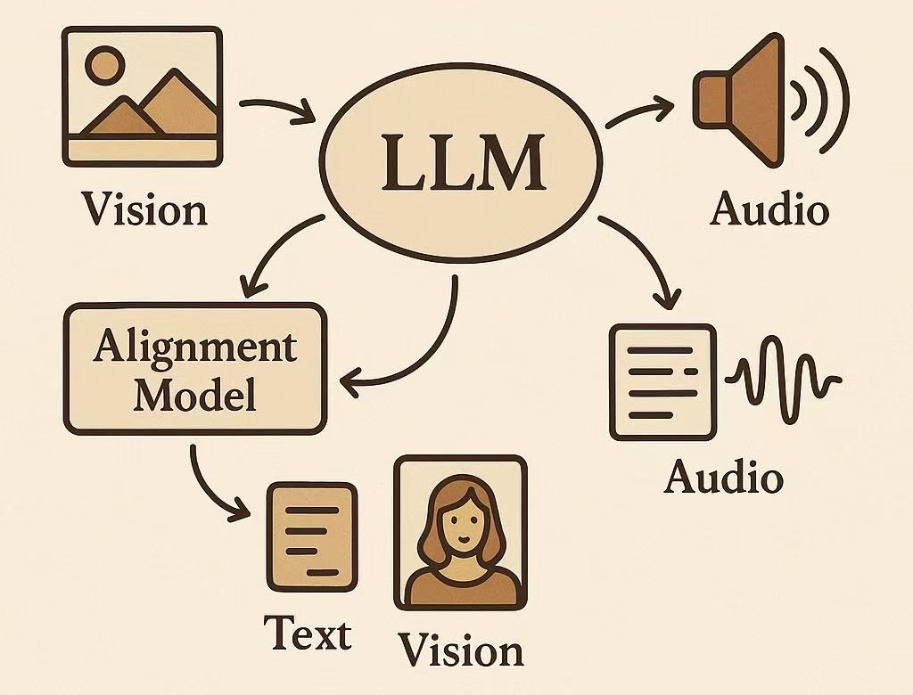
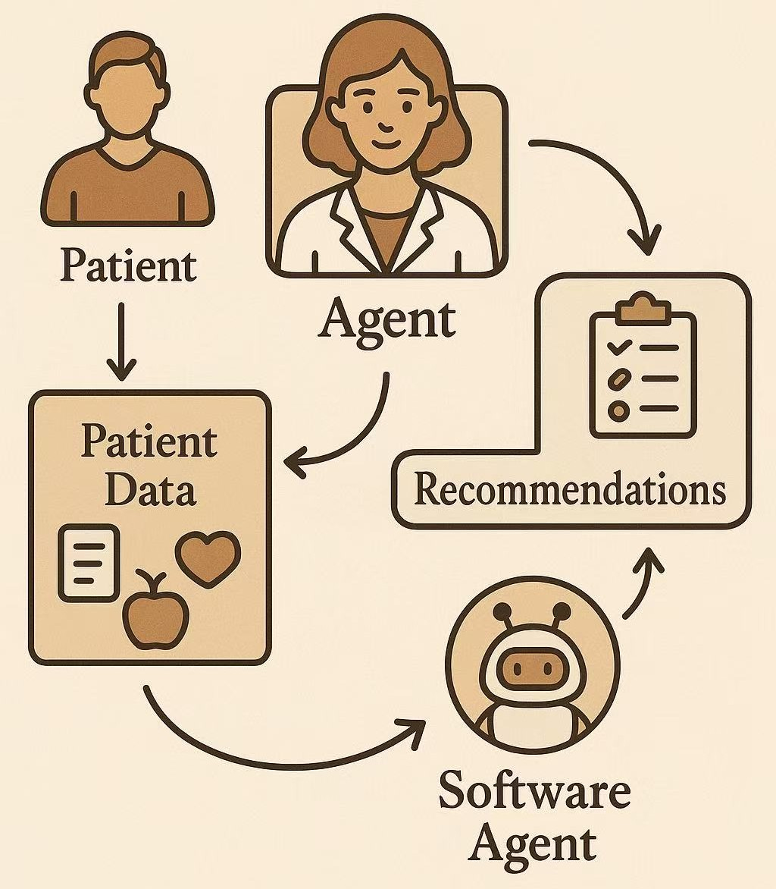

Pengfei Zhang is a PHD student in UC Irvine, with a strong research focus on intelligent systems at the intersection of large language models (LLMs), speech, and vision. Most of his work centers around building multimodal agent frameworks that unify language, audio, and visual modalities to enhance decision-making in human-centric tasks. His projects span LLM-enhanced automatic speech recognition, multimodal alignment of LLMs for speech and visual understanding and generation, and agent-based personalized healthcare recommendation systems. His resume is presented in [Pengfei’s CV](files/PengfeiZhang_resume2.pdf).

---

#### NEWS 

06/2025：:fireworks: One paper, [\[KinMo\]](https://andypinxinliu.github.io/KinMo/), is accepted by ICCV 2025!

06/2025: :fist: Start an Applied Scientist Intern position at Amazon Web Service AI Lab!

06/2025: One paper is accepted by AMIA 2025!

12/2024: :fireworks: One paper, [\[DEMENTIA-PLAN\]](https://openreview.net/pdf?id=m7KkNKMDVp), is accepted by AAAI W 2025!

06/2024: :fist: Start a research scientist intern position at Flawless. Inc!

10/2023: One paper is accepted by WACV 2024!

<!-- ##### Website Introduction

My scientific experiences are recorded in [research](https://zpf0117b.github.io/PengfeiZhang.github.io/research/) and [publications](https://zpf0117b.github.io/PengfeiZhang.github.io/publications/).  -->

<!-- <embed src="http://files2.17173.com/__flash/2011/10/21/honehone_clock_tr.swf"> -->

# Research

### Multimodal Alignment of LLMs for Speech and Visual Understanding and Generation

| Jan 2023 - Present       | &nbsp;         |
| ---- |:---------------:|
| Multimodal alignment of LLMs for speech and visual understanding and generation aims to bridge language, audio, and vision into a unified semantic space. By synchronizing temporal and contextual cues across modalities—such as aligning speech with co-speech gestures or visual actions—LLMs can generate coherent, context-aware outputs that reflect human-like perception and behavior. This enables applications like gesture generation, motion synthesis, and audiovisual narration grounded in natural language. |  | 
| **Publications:**        | &nbsp;         |
|  | KinMo: Kinematic-aware Human Motion Understanding and Generation.  **Pengfei Zhang**, Pinxin Liu, Pablo Garrido, Hyeongwoo Kim, Bindita Chaudhuri.  ICCV 2025   [\[project\]](https://andypinxinliu.github.io/KinMo/) [\[preprint\]](https://arxiv.org/abs/2411.15472) [\[demo\]](https://andypinxinliu.github.io/KinMo/static/videos/KinMo-Demo.mp4) |
|  |  Contextual Gesture: Co-Speech Gesture Video Generation through Semantic-aware Gesture Representation.  Pinxin Liu, **Pengfei Zhang**, Hyeongwoo Kim, Pablo Garrido, Ari Shapiro, Kyle Olszewski.  ACM MM 2025   [\[project\]](https://andypinxinliu.github.io/Contextual-Gesture/) [\[preprint\]](https://arxiv.org/abs/2502.07239)  |
|  |  Handformer2T: A Lightweight Regression-based model for Interacting Hands Pose Estimation from a single RGB Image.  **Pengfei Zhang**, Deying Kong.   WACV 2024   [\[paper\]](https://openaccess.thecvf.com/content/WACV2024/html/Zhang_Handformer2T_A_Lightweight_Regression-Based_Model_for_Interacting_Hands_Pose_Estimation_WACV_2024_paper.html) |

### LLM-enhanced Automatic Speech Recognition

| Jan 2023 - Present       | &nbsp;         |
| ---- |:---------------:|
| LLM-enhanced automatic speech recognition (ASR) integrates large language models with traditional ASR pipelines to improve transcription accuracy, particularly in domain-specific and noisy scenarios. By leveraging external knowledge sources—such as medical knowledge graphs—and contextual understanding, LLMs can correct recognition errors, disambiguate terms, and enhance spoken question answering. This hybrid approach enables more robust and semantically informed speech understanding in complex applications like healthcare. |  | 
| **Publications:**        | &nbsp;         |
|  | MedSpeak: Knowledge Enhanced ASR Error Correction framework for Spoken Medical Question Answering |
|  |  Contextual Gesture: Co-Speech Gesture Video Generation through Semantic-aware Gesture Representation.  Pinxin Liu, **Pengfei Zhang**, Hyeongwoo Kim, Pablo Garrido, Ari Shapiro, Kyle Olszewski.  ACM MM 2025   [\[project\]](https://andypinxinliu.github.io/Contextual-Gesture/) [\[preprint\]](https://arxiv.org/abs/2502.07239)  |

### Agent-based Personalized Healthcare Recommendation Systems

| Sep 2021 - Present       | &nbsp;         |
| ---- |:---------------:|
| Agent-based personalized healthcare recommendation systems leverage autonomous software agents to analyze individual patient data—such as medical history, lifestyle, and preferences—to deliver tailored health advice and treatment options. These systems can interact dynamically with users and other agents (e.g., diagnostic or monitoring tools), adapting recommendations in real time to improve decision-making and patient outcomes. |  |
| **Publications:**        | &nbsp; |
|  | Adaptive Constraint Relaxation in Personalized Nutrition Recommendations: An LLM-Driven Knowledge Graph Retrieval Approach  Pengfei Zhang, Mohbat Fnu, Yutong Song, Oshani Seneviratne, Zhongqi Yang, Iman Azimi, Amir M. Rahmani  AMIA - American Medical Informatics Association  [\[preprint\]](http://dx.doi.org/10.13140/RG.2.2.29331.80163) |
|  | DEMENTIA-PLAN: An Agent-Based Framework for Multi-Knowledge Graph Retrieval-Augmented Generation in Dementia Care.  Yutong Song, Chenhan Lyu, **Pengfei Zhang**, Sabine Brunswicker, Nikil Dutt, Amir M. Rahmani.  AAAI 2025 Workshop: Knowledge Graphs for Health Equity, Justice, and Social Services  [\[preprint\]](https://openreview.net/pdf?id=m7KkNKMDVp) |
|  | Knowledge-Infused LLM-Powered Conversational Health Agent: A Case Study for Diabetes Patients.  Mahyar Abbasian, Zhongqi Yang, Elahe Khatibi, **Pengfei Zhang**, Nitish Nagesh, Iman Azimi, Ramesh Jain, Amir M. Rahmani.  EMBC 2024   [\[paper\]](https://arxiv.org/abs/2402.10153) [\[code\]](https://github.com/Institute4FutureHealth/CHA) [\[website\]](https://www.opencha.com/) |
|  | CLMB: deep contrastive learning for robust metagenomic binning **Pengfei Zhang**, Zhengyuan Jiang, Yixuan Wang, Yu Li. RECOMB 2022 (oral) [\[paper\]](https://doi.org/10.1101/2021.11.15.468566) [\[code\]](https://github.com/zpf0117b/CLMB/) [\[blog\]](https://zpf0117b2.github.io/feifei.github.io/2022/01/20/contrastive-learning-for-robust-metagenome-binning/)     |

# Internships

2025 Applied Scientist Intern at Amazon Web Service AI Lab. Location: Santa Clara

2024 Research Science Intern at Flawless. AI. Inc. Location: Los Angeles

2022 Research Intern in the Chinese University of Hong Kong. Location: Hong Kong

# Projects

| Personal Software Programming Projects  | &nbsp;         |
| ---- |:---------------:|
| [\[Distributed Chatroom with LLaMa-Powered Summarization\]](https://github.com/zpf0117b/Distributed-Chatroom-with-LLaMa-Powered-Summarization)  |  A Multi-topic Web Chatroom which can provide backup on previous conversations and LLaMa Powered summarizations after each refresh |

# Awards

Dean's award from UCI

National Encouragement Scholarship (top 20%) from USTC

National Encouragement Scholarship (top 20%) from USTC
