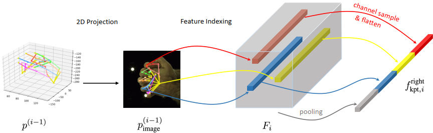

TO BE CONSTRUCTED

---

<!-- #### NEWS 

06/2024: Start a position at Flawless. Inc!

10/2023: One paper is accepted by WACV 2024! -->
<!-- 
10/2023: Switched to the new lab with research on artificial intelligence, computer vision, and large language model for healthcare!

05/2022: One paper is accepted by RECOMB 2023 for oral presentation! -->

<!-- ##### Website Introduction

My scientific experiences are recorded in [research](https://zpf0117b.github.io/PengfeiZhang.github.io/research/) and [publications](https://zpf0117b.github.io/PengfeiZhang.github.io/publications/).  -->

<!-- <embed src="http://files2.17173.com/__flash/2011/10/21/honehone_clock_tr.swf"> -->

#### Research

##### Motion Synthesis and Generation

| Jan 2023 - Present       | &nbsp;         |
| ---- |:---------------:|
| Human motion synthesis and generation is a multifaceted field that combines computer vision, graphics, and machine learning to understand, generate, and control human movements. It encompasses three main components: motion understanding, which analyzes human movements and poses; motion generation, which creates realistic movement sequences using data-driven and physics-based approaches; and trajectory control, which focuses on manipulating and directing generated movements to achieve specific goals. The field employs various deep learning models like Transformers, VQ-VAEs, and Diffusion Models, finding applications in animation, virtual reality, robotics, healthcare, and sports, while continuing to address challenges in physical plausibility, style preservation, and real-time performance. |       |
| **Publications:**        | &nbsp;         |
|       | Handformer2T: A Lightweight Regression-based model for Interacting Hands Pose Estimation from a single RGB Image.  **Pengfei Zhang**, Deying Kong.    WACV 2024 (accepted)  [\[paper\]](https://openaccess.thecvf.com/content/WACV2024/html/Zhang_Handformer2T_A_Lightweight_Regression-Based_Model_for_Interacting_Hands_Pose_Estimation_WACV_2024_paper.html) |

##### Healthcare Informatics