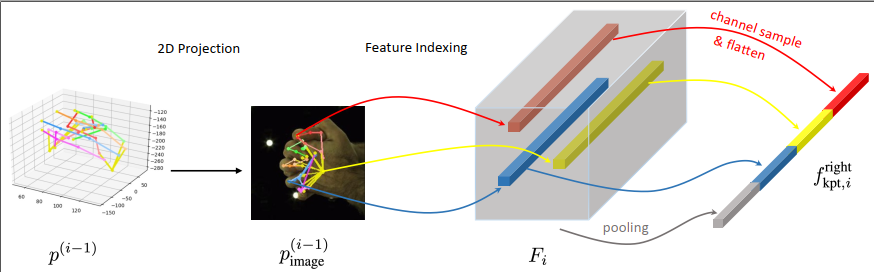
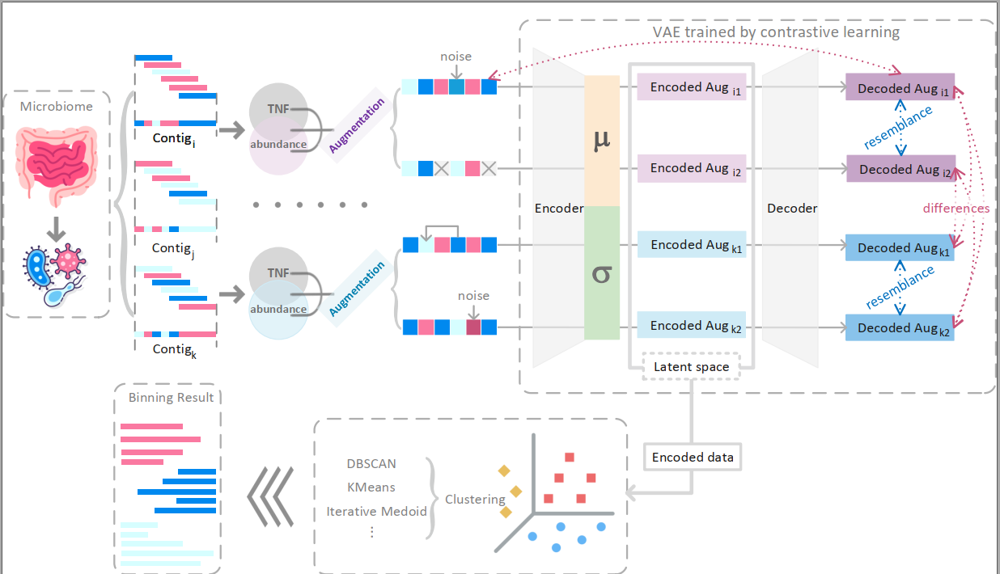
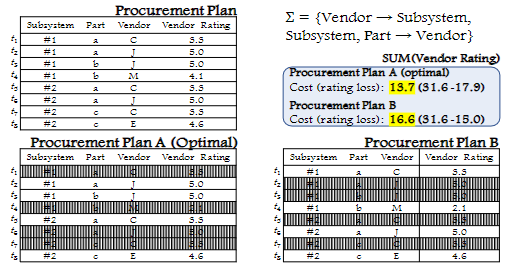

<!-- |  | **Paper Title** Authors: Your Name, Co-Author Published in: Journal/Conference Name, Year [Link to Paper](paper-link)  Abstract: Brief description of the paper. |
|---|---| -->

## Conferences

|  | **Pengfei Zhang**, Deying Kong. (2023) Handformer2T: A Lightweight Regression-based model for Interacting Hands Pose Estimation from a single RGB Image. WACV 2024 (accepted) 
|  | **Pengfei Zhang**, Zhengyuan Jiang, Yixuan Wang, Yu Li. (2022) <a href="https://doi.org/10.1101/2021.11.15.468566">CLMB: deep contrastive learning for robust metagenomic binning</a>. RECOMB 2022 (oral). [Author's Blog](https://zpf0117b.github.io/PengfeiZhang.github.io/2022/01/20/contrastive-learning-for-robust-metagenome-binning/) |
|---|---|

## Journals
|  | Dongjing Miao, **Pengfei Zhang**, Jianzhong Li, Ye Wang, Zhipeng Cai. (2022) <a href="https://link.springer.com/article/10.1007/s00778-022-00738-0">Approximation and Inapproximability Results on Computing Optimal Repairs</a>. VLDB Journal (2022) |
|---|---|
<!-- ## Preprints -->
