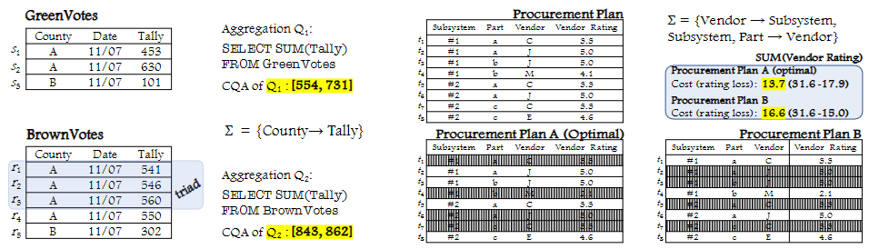

<!-- |  | **Paper Title** Authors: Your Name, Co-Author Published in: Journal/Conference Name, Year [Link to Paper](paper-link)  Abstract: Brief description of the paper. |
|---|---| -->

## Conferences
<!-- [Author's Blog](https://zpf0117b.github.io/PengfeiZhang.github.io/2022/01/20/contrastive-learning-for-robust-metagenome-binning/) -->

| &nbsp;        | &nbsp;         |
| ---- |:---------------:|
|       | Handformer2T: A Lightweight Regression-based model for Interacting Hands Pose Estimation from a single RGB Image.  **Pengfei Zhang**, Deying Kong.    WACV 2024 (accepted)  paper |
|       | CLMB: deep contrastive learning for robust metagenomic binning **Pengfei Zhang**, Zhengyuan Jiang, Yixuan Wang, Yu Li. RECOMB 2022 (oral) [\[paper\]](https://doi.org/10.1101/2021.11.15.468566) [\[code\]](https://github.com/zpf0117b/CLMB/)      |

## Journals

| &nbsp;        | &nbsp;        |
| ---- |:---------------:|
|  | Approximation and Inapproximability Results on Computing Optimal Repairs Dongjing Miao, **Pengfei Zhang**, Jianzhong Li, Ye Wang, Zhipeng Cai. VLDB Journal [\[paper\]](https://link.springer.com/article/10.1007/s00778-022-00738-0) |

