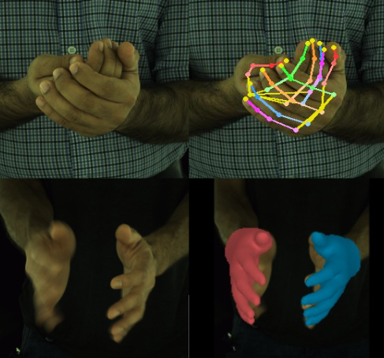
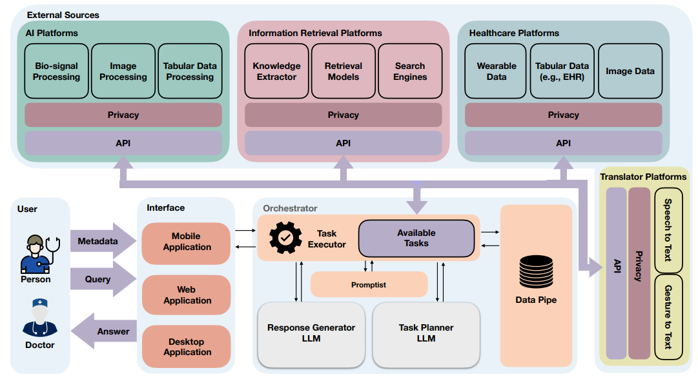

## Human Hand Motion Estimation and Gait Forecasting

Jan 2023 - Present

| &nbsp;        | &nbsp;         |
| ---- |:---------------:|
| Human Hand Motion Estimation and Gait Forecasting delve into the complexities of human hand movements and walking patterns, with the goal of understanding and predicting them. Hand motion estimation is particularly focused on the precise prediction and analysis of hand movements, playing a crucial role in interpreting gestures and enhancing advanced technological interfaces. In contrast, gait forecasting concentrates on predicting future walking patterns or identifying potential abnormalities in an individual's gait, a key element in both proactive healthcare and security.  These advancements bring significant benefits across various fields. In healthcare, they promise to transform rehabilitation by offering tailored therapy plans for patients with hand injuries or neurological conditions, thereby greatly improving treatment outcomes. Moreover, in the field of robotics, an intricate understanding of human motion can guide the creation of more lifelike robotic systems. This not only narrows the gap between artificial and natural movements but also expands the capabilities and applications of robotics in everyday life.    |        |
| **Selected publications:**        | &nbsp;         |
| Handformer2T: A Lightweight Regression-based model for Interacting Hands Pose Estimation from a single RGB Image. (WACV 2024)        | First author  |

---

## Large Language Models as Artificial Healthcare Assistant

Oct 2023 - Present

| &nbsp;        | &nbsp;         |
| ---- |:---------------:|
| 
Large Language Models (LLMs) like ChatGPT, operating as artificial healthcare assistants, offer transformative potential in medical settings. They enhance patient care by improving communication clarity and efficiency, particularly through their ability to interpret spoken language and convert between unstructured and structured information in medical documentation. These models augment medical competencies, including factual knowledge and communication skills, thereby aiding in clinical decision-making and patient consultations. LLMs also significantly reduce the administrative burden on clinicians by streamlining documentation processes. In research, they democratize access to scientific knowledge, assisting in summarizing complex concepts and improving the communication of research findings. However, their deployment in healthcare necessitates careful management due to concerns about misinformation, biases, and potential misuse. Implementing robust data governance, error monitoring, and regulatory compliance is crucial to maximize their benefits while mitigating risks.   |        |
